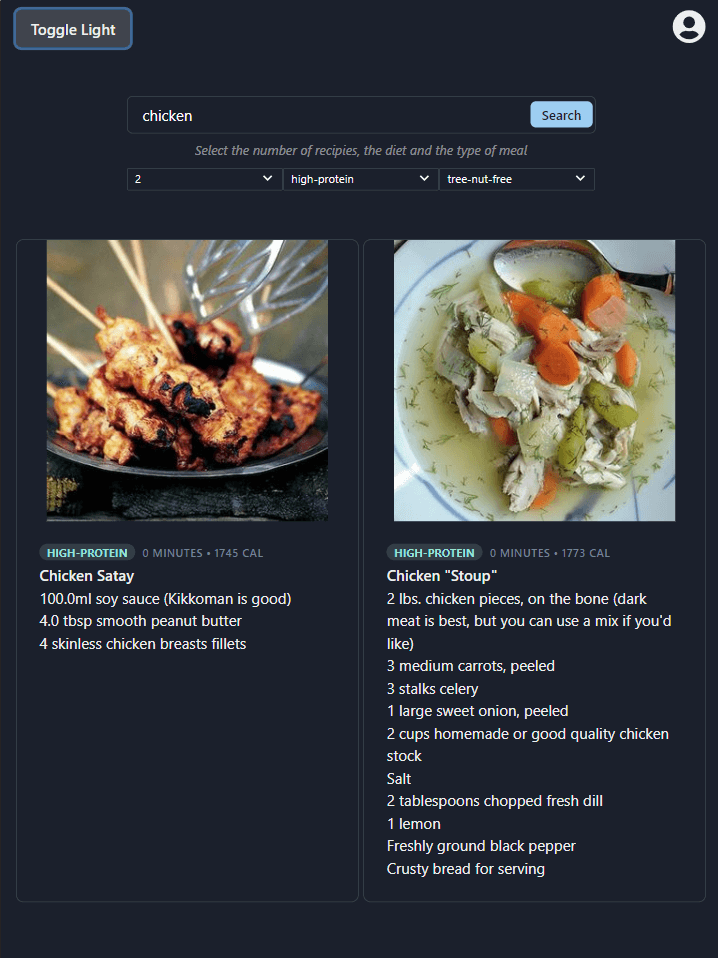

## Table of contents
* [General info](#general-info)
* [Technologies](#technologies)
* [Setup](#setup)
* [Illustrations](#illustrations)
* [Features](#features)
* [Credits](#credits)

## General info
A single page application which allows you to search for recipes matching the specified query.

## Technologies
Project is created with:
* react version: 16.14.0
* react-hook-form version: ^6.14.1
* chakra-ui/react version: ^1.1.4

## Setup
To run this project, install it locally using npm:

```
$ npm install
$ npm start
```

## Illustrations



## Features
Edamam's Recipe Search API lets you integrate recipes and faceted recipe search into your websites or mobile applications.

## Credits
See more at https://developer.edamam.com/

